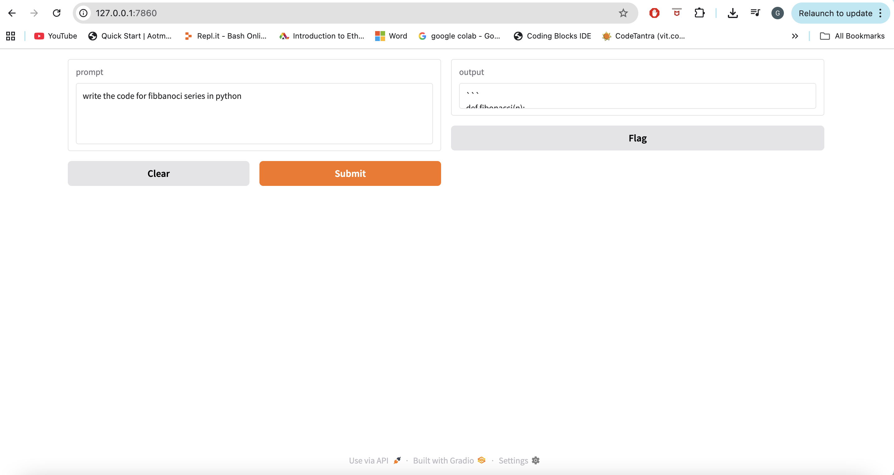

# 💻 Ollama Code Assistant with Gradio (Custom Code Llama Model)

A simple and interactive web-based coding assistant powered by the **Ollama** large language model and built with the **Gradio** framework. This application is configured to use your custom **Code Llama-based model** (`codeguru`) served via the Ollama API, allowing users to input prompts and receive generated code.

## ✨ Features

* **Code Generation:** Convert natural language prompts into executable code.
* **Ollama Integration:** Uses a custom model named `codeguru` running on an Ollama server.
* **Custom Model Built:** Explicitly documents the use of a **Modelfile** for custom behavior (e.g., specific system prompts, parameters) based on the Code Llama model.
* **Conversational Memory:** Maintains a conversation history within the session to provide context-aware responses.
* **User Interface:** A simple, interactive web UI provided by Gradio.

---

## 📸 User Interface

The application provides a simple, clean interface built using Gradio.



---

## 🚀 Getting Started

Follow these steps to set up and run the Code Assistant locally.

### Prerequisites

You need to have **Python** and the **Ollama** server running with your custom `codeguru` model.

1.  **Python:** Ensure you have Python installed (version 3.7+ recommended).
    
2.  **Dependencies:** Install the required Python packages:
    ```bash
    pip install requests gradio
    ```

3.  **Ollama Server & Custom Model Setup:**
    
    * [Install Ollama](https://ollama.com/download) and ensure the Ollama service is running.
    * **Create a `Modelfile`:** In the directory where you plan to run your application, create a file named `Modelfile`. This file defines your model's base and behavior. A typical file based on Code Llama might look like this (you can customize the `SYSTEM` prompt):
        ```
        FROM codellama
        SYSTEM You are an expert Python and JavaScript programmer. Respond only with the requested code and a very brief explanation.
        PARAMETER temperature 0.2
        ```
    * **Build the Custom Model:** Use the `ollama create` command to build your custom model named `codeguru` from the `Modelfile`:
        ```bash
        ollama create codeguru -f Modelfile
        ```

### Configuration

Before running, you must update the `url` variable in your Python script (`app.py` or similar) to point to your running Ollama API endpoint.

```python
# In your Python file (e.g., app.py)
# Note: Ollama API is typically at port 11434
url = "http://localhost:11434/api/generate"
